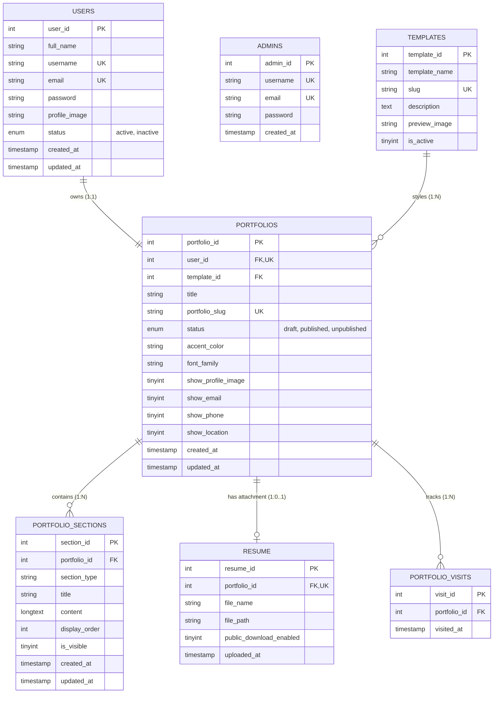
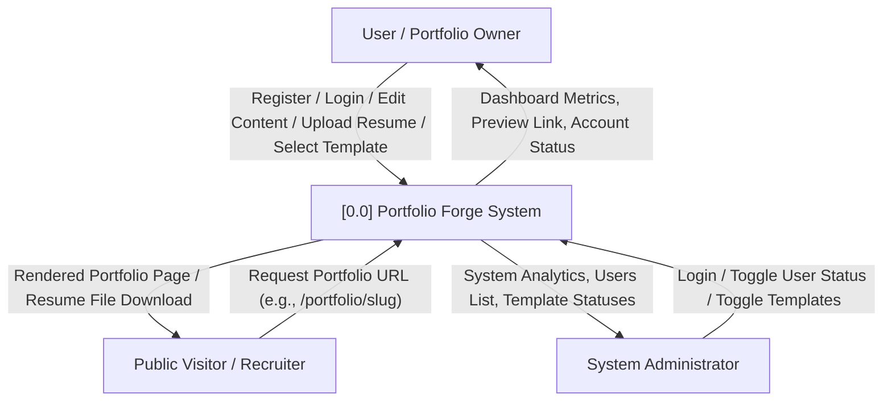
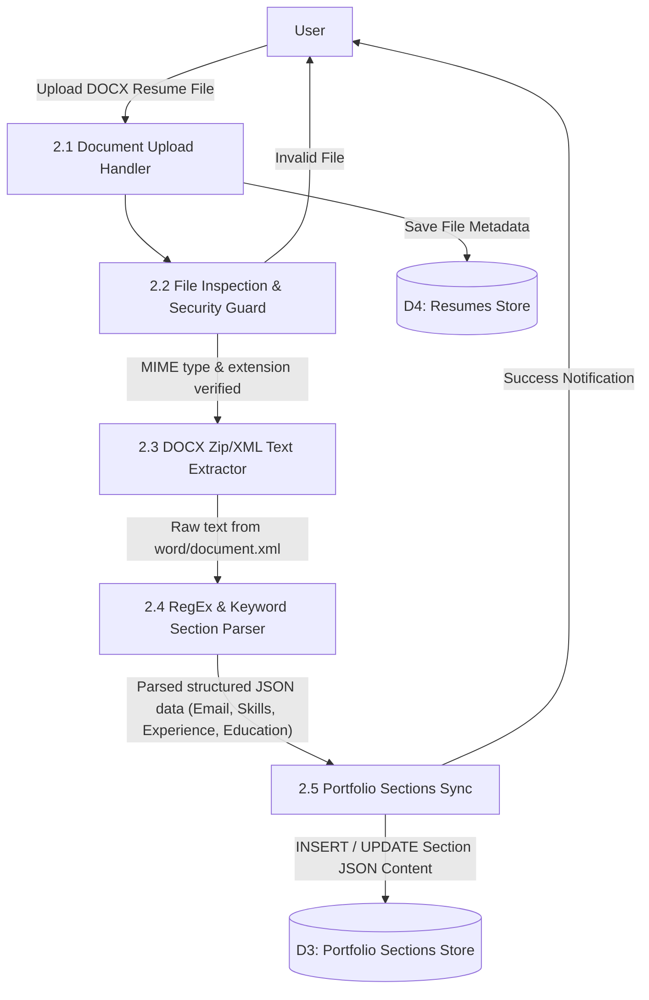
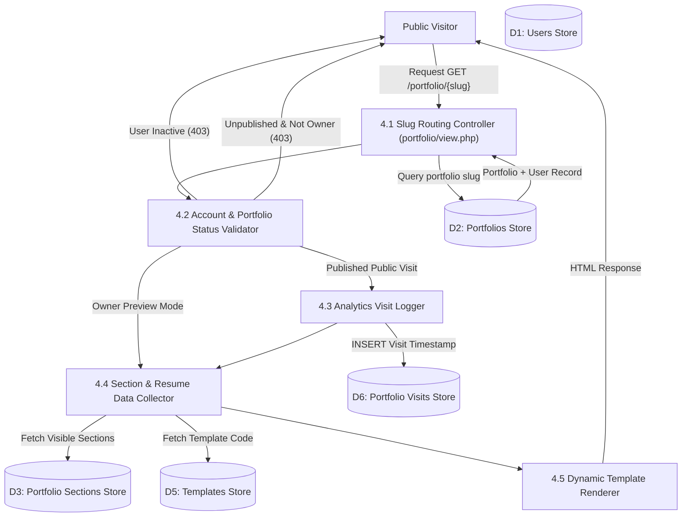

# Portfolio Forge - Developer Documentation

Welcome to the **Portfolio Forge** Developer Documentation. This guide provides comprehensive architecture overview, setup instructions, entity-relationship diagrams (ERD), data flow diagrams (DFD), module walkthroughs, security guidelines, and testing procedures to assist software engineers in understanding, maintaining, and extending the codebase.

---

## 1. Executive Summary & Architecture Overview

**Portfolio Forge** is a web application written in standard PHP 8+ and MySQL/MariaDB. It allows users to build, edit, customize, and publish digital portfolio websites without writing code.

### Architectural Principles
- **Model-View Pattern (Modular PHP)**: Separation between administrative tools, user dashboard components, public template views, core helper functions, and database configuration.
- **Strict 1:1 User-to-Portfolio Binding**: Every registered user account owns exactly one portfolio instance (`portfolios.user_id` unique constraint).
- **Dynamic Template Separation**: Portfolio visual styling is separated from user content data. Content stored in standard database structures (`portfolios`, `portfolio_sections`, `resume`) is rendered dynamically through template renderers (`templates/<slug>/view.php`). Changing templates preserves all user data.
- **Automated Resume Text Extraction**: Non-AI document parsing engine using native PHP `ZipArchive` & `DOMDocument` for Word documents (`.docx`), extracting structured resume sections into editable portfolio fields via regex and keyword matching.
- **Analytics Isolation**: Public visits increment real-time page metrics (`portfolio_visits`), while portfolio owner previews (`/user/preview.php`) are explicitly excluded from visit metrics.

---

## 2. Directory Structure

```
/portfolio-forge
├── /admin                      # Administrative Portal
│   ├── dashboard.php           # Admin analytics & platform overview
│   ├── login.php               # Admin authentication handler
│   ├── logout.php              # Admin session termination
│   ├── templates.php           # System template toggle manager
│   └── users.php               # Account status management (activate/deactivate)
├── /assets                     # Frontend Static Resources
│   ├── /css
│   │   ├── dashboard.css       # User and admin dashboard layouts
│   │   ├── style.css           # Global typography, utility classes, navigation
│   │   └── templates.css       # Portfolio design system and template styling
│   └── /images                 # Visual assets and preview thumbnails
├── /config                     # Application Configuration
│   └── database.php            # PDO MySQL connection factory & credentials
├── /includes                   # Shared Modules & Utility Libraries
│   ├── admin-auth.php          # Admin session verification guard
│   ├── admin-sidebar.php       # Admin navigation component
│   ├── auth.php                # User session guard & account active status check
│   ├── footer.php              # Global HTML footer component
│   ├── functions.php           # Helper functions (DOCX parser, CSRF, upload, slug)
│   └── header.php              # Global HTML header & flash alert component
├── /portfolio                  # Public Portfolio Entry Point
│   └── view.php                # Public routing engine, visit recorder, & template loader
├── /templates                  # Portfolio Template Renderers
│   ├── /classic                # Traditional CV layout renderer
│   ├── /creative               # Expressive visual layout renderer
│   ├── /minimal                # Whitespace-focused minimalist layout renderer
│   ├── /modern                 # Modern card & hero layout renderer
│   └── /professional           # Formal corporate layout renderer
├── /tests                      # Test Automation Suite
│   ├── test_updates.php        # System verification & functional unit test script
│   └── verify_app.php          # Automated integration & database validation suite
├── /uploads                    # User Media & Document Storage
│   ├── /profiles               # Uploaded avatar images
│   └── /resumes                # Uploaded resume documents
├── .htaccess                   # Apache URL rewrite rules for clean slugs
├── database.sql                # Relational schema DDL & seed data
├── DEVELOPER.md                # Developer technical documentation
├── index.php                   # Public landing page & template showcase
├── login.php                   # User login controller & view
├── logout.php                  # User logout controller
├── register.php                # User registration controller & view
└── test.php                    # Environment test utility
```

---

## 3. Environment & Setup Guide

### System Requirements
- **PHP**: Version 8.0 or higher (Required extensions: `pdo`, `pdo_mysql`, `zip`, `dom`, `fileinfo`, `iconv`).
- **Database**: MySQL 5.7+ or MariaDB 10.2+.
- **Web Server**: Apache 2.4+ (with `mod_rewrite` enabled) or Nginx.

### Database Setup
1. Create a database in MySQL named `portfolio_forge`:
   ```sql
   CREATE DATABASE IF NOT EXISTS `portfolio_forge` DEFAULT CHARACTER SET utf8mb4 COLLATE utf8mb4_unicode_ci;
   ```
2. Import the schema DDL and seed data:
   ```bash
   mysql -u root -p portfolio_forge < database.sql
   ```

### Application Configuration
Update database connection settings in `config/database.php`:
```php
define('DB_HOST', 'localhost');
define('DB_USER', 'root');
define('DB_PASS', '');
define('DB_NAME', 'portfolio_forge');
```

---

## 4. Entity-Relationship Diagram (ERD)

The relational database consists of 7 primary tables designed around third normal form (3NF), ensuring data integrity via foreign keys and cascading rules.



### Table Relationships & Key Constraints
1. `USERS (1) <---> (1) PORTFOLIOS`: Enforces one portfolio per user (`user_id` is unique in `portfolios`). ON DELETE CASCADE.
2. `TEMPLATES (1) <---> (N) PORTFOLIOS`: Defines template selected for rendering. ON DELETE RESTRICT.
3. `PORTFOLIOS (1) <---> (N) PORTFOLIO_SECTIONS`: Stores modular content sections (About, Education, Skills, Projects, Experience, etc.). ON DELETE CASCADE.
4. `PORTFOLIOS (1) <---> (0..1) RESUME`: Stores uploaded original document reference. ON DELETE CASCADE.
5. `PORTFOLIOS (1) <---> (N) PORTFOLIO_VISITS`: Records timestamped public page views for analytics calculation. ON DELETE CASCADE.

---

## 5. Data Flow Diagrams (DFD)

### DFD Level 0: Context Diagram



---

### DFD Level 1: High-Level System Processes Diagram

```mermaid
graph TD
    User["User"]
    Visitor["Public Visitor"]
    Admin["Administrator"]

    subgraph Data Stores
        DS_Users[("D1: Users Store")]
        DS_Portfolios[("D2: Portfolios Store")]
        DS_Sections[("D3: Portfolio Sections Store")]
        DS_Resumes[("D4: Resumes Store")]
        DS_Templates[("D5: Templates Store")]
        DS_Visits[("D6: Portfolio Visits Store")]
    end

    %% Process 1: Auth
    P1["1.0 User & Admin Authentication"]
    User -- "Credentials" --> P1
    Admin -- "Admin Credentials" --> P1
    P1 -- "Read / Validate" --> DS_Users
    P1 -- "Session Created" --> User

    %% Process 2: Portfolio & Resume Management
    P2["2.0 Portfolio & Resume Processing"]
    User -- "Upload Resume / Edit Sections" --> P2
    P2 -- "Extract & Write Content" --> DS_Sections
    P2 -- "Save Resume Metadata" --> DS_Resumes
    P2 -- "Update Portfolio Info" --> DS_Portfolios

    %% Process 3: Template & Configuration
    P3["3.0 Template Selection & Customization"]
    User -- "Select Template / Styling" --> P3
    P3 -- "Read Templates" --> DS_Templates
    P3 -- "Save Styling" --> DS_Portfolios

    %% Process 4: Public View & Analytics
    P4["4.0 Public Portfolio Rendering & Analytics"]
    Visitor -- "HTTP Request GET /portfolio/slug" --> P4
    P4 -- "Fetch Portfolio & User" --> DS_Portfolios
    P4 -- "Fetch Sections" --> DS_Sections
    P4 -- "Fetch Template Layout" --> DS_Templates
    P4 -- "Record Visit (if Published)" --> DS_Visits
    P4 -- "Rendered Portfolio HTML" --> Visitor

    %% Process 5: Administration
    P5["5.0 Platform Administration"]
    Admin -- "Manage Accounts / Templates" --> P5
    P5 -- "Update Status" --> DS_Users
    P5 -- "Toggle Template Availability" --> DS_Templates
    P5 -- "Read Platform Stats" --> DS_Visits
```



---

### DFD Level 2: Process 2.0 - Resume Upload & Document Extraction



---

### DFD Level 2: Process 4.0 - Public Portfolio Viewing & Analytics Tracking



---

## 6. Core Functionality Walkthrough

### 1. Authentication & Security Framework (`includes/auth.php`, `includes/functions.php`)
- **Password Hashing**: Passwords are saved using standard `password_hash($password, PASSWORD_DEFAULT)` and validated with `password_verify()`.
- **CSRF Defense**: State-changing forms emit a hidden token generated via `generateCsrfToken()`. Incoming POST actions validate tokens via `verifyCsrfToken($_POST['csrf_token'])`.
- **Session Guards**: `requireLogin()` verifies `$_SESSION['user_id']` exists and queries `users.status`. Inactive accounts are immediately logged out and redirected with an error message.

### 2. Resume Text Extraction & Parsing Engine (`includes/functions.php`)
- **`extractTextFromDOCX($filepath)`**: Opens `.docx` archives using PHP `ZipArchive`, extracts `word/document.xml`, parses XML elements via `DOMDocument` and `DOMXPath`, and extracts paragraph and table text while preserving structure.
- **`parseResumeText($text)`**: Extracts key details:
  - **Email & Phone**: Regex pattern matching (`/[a-zA-Z0-9._%+\-]+@[a-zA-Z0-9.\-]+\.[a-zA-Z]{2,}/`).
  - **Full Name**: Inspects non-empty header lines while excluding common keywords.
  - **Section Buffering**: Groups lines under standard section keywords (`summary`, `education`, `skills`, `projects`, `experience`, `certifications`, `achievements`, `languages`, `activities`, `interests`).

### 3. Dynamic Template System (`templates/`)
Templates reside in subdirectories named after their database slug (`modern`, `minimal`, `professional`, `creative`, `classic`). Each template directory contains a `view.php` layout renderer. Changing template selection updates `portfolios.template_id` without altering section data in `portfolio_sections`.

---

## 7. Testing & Verification

Automated PHP verification scripts are provided in the `/tests` folder to validate application integrity:

```bash
# Run overall application verification script
php tests/verify_app.php

# Run functionality update test script
php tests/test_updates.php
```

### Verified Test Routines
1. **Schema & Seed Verification**: Checks table existence and template records.
2. **User Authentication & Session Workflow**: Validates registration, duplicate constraints, and password hashing.
3. **1:1 Portfolio Auto-Creation**: Confirms `getOrCreateUserPortfolio()` initializes portfolio records and default sections.
4. **Section CRUD Operations**: Verifies section addition, display ordering, and JSON content encoding.
5. **Template Switching & Data Loss Prevention**: Ensures switching templates preserves all sections.
6. **Analytics & Owner Exclusion**: Verifies visit logging increments counter for public views while skipping logged-in owner previews.
