# CHAPTER 8: SYSTEM IMPLEMENTATION AND MODULES

## 8.1 Landing Page Module
The landing page acts as the public entry point to Portfolio Forge. It introduces the system, displays core platform features, previews available portfolio templates, and provides navigation to registration and login functionality.

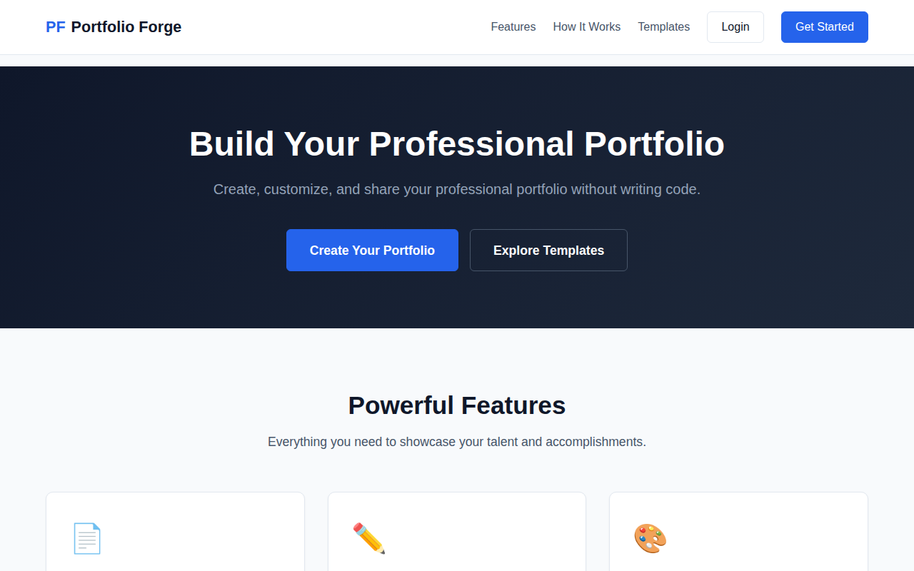

*Figure 8.1 Landing Page Module: Landing Page Module*

---

## 8.2 User Registration Module
The registration module collects required user information (Full Name, Username, Email, Password), validates input parameters, checks unique account constraints, securely hashes the user password using `password_hash()`, and creates the user account in the database.

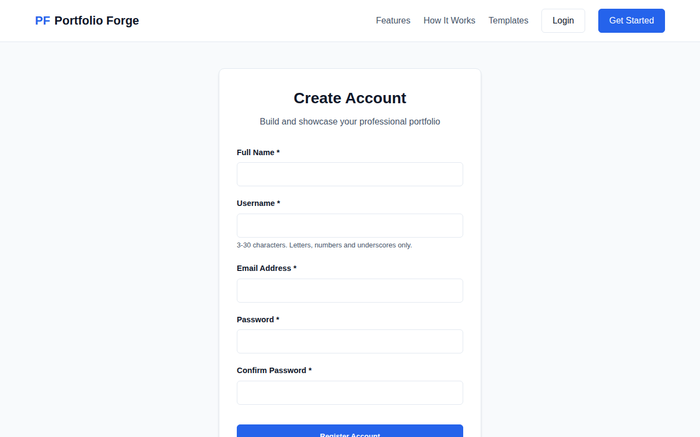

*Figure 8.2 User Registration Module: User Registration Module*

---

## 8.3 User Login and Authentication Module
The authentication module validates username/email and password credentials against database records, verifies active account status, initializes a secure PHP session, and restricts access to protected user and administrator endpoints.

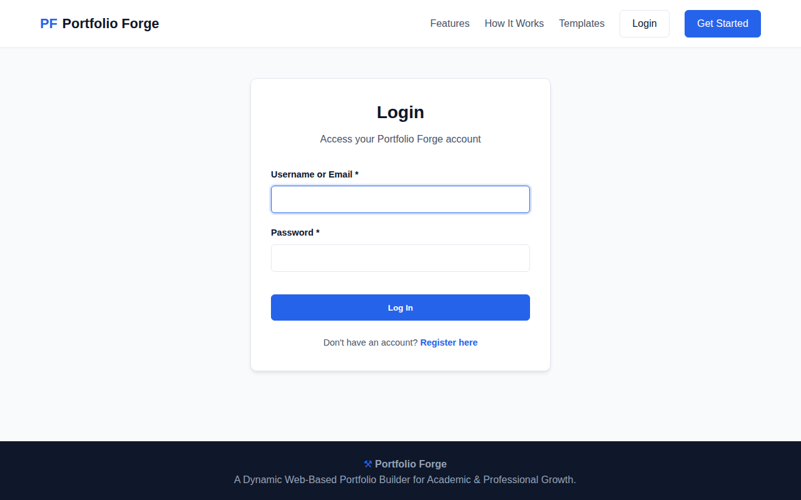

*Figure 8.3 User Login and Authentication Module: User Login and Authentication Module*

---

## 8.4 User Dashboard Module
The dashboard provides the main control interface for portfolio management, presenting key metrics (publication status, active template, total views, resume status), quick action shortcuts, personalized portfolio URL access, and navigation to editing, preview, templates, customization, and statistics.

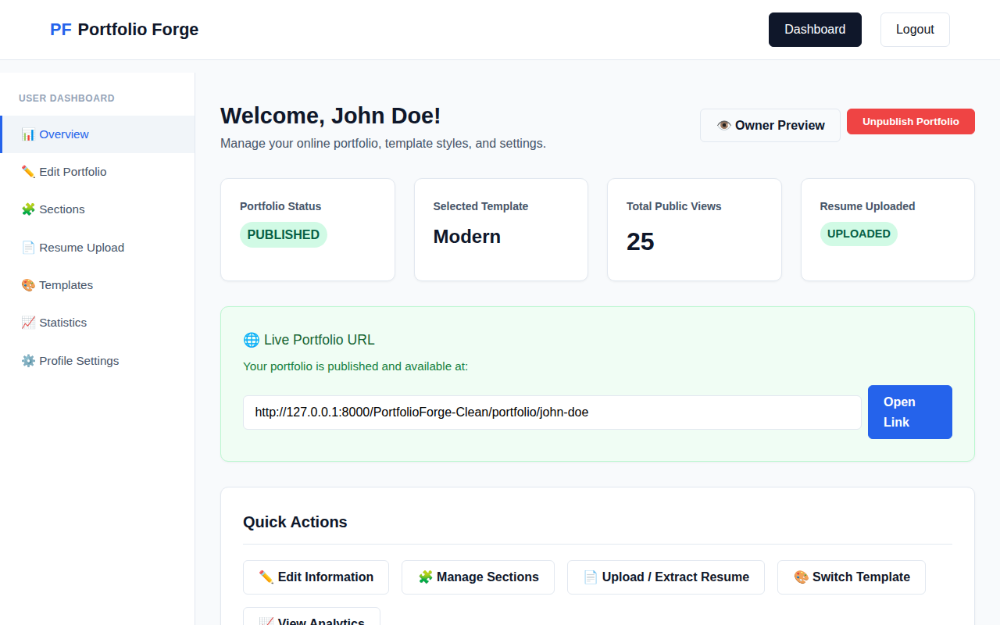

*Figure 8.4 User Dashboard Module: User Dashboard Module*

---

## 8.5 Portfolio Information Module
This module allows users to manage general portfolio settings, including portfolio title, personalized clean URL slug, accent color selection, font family preferences, profile picture uploads, and public display visibility toggles for contact information.

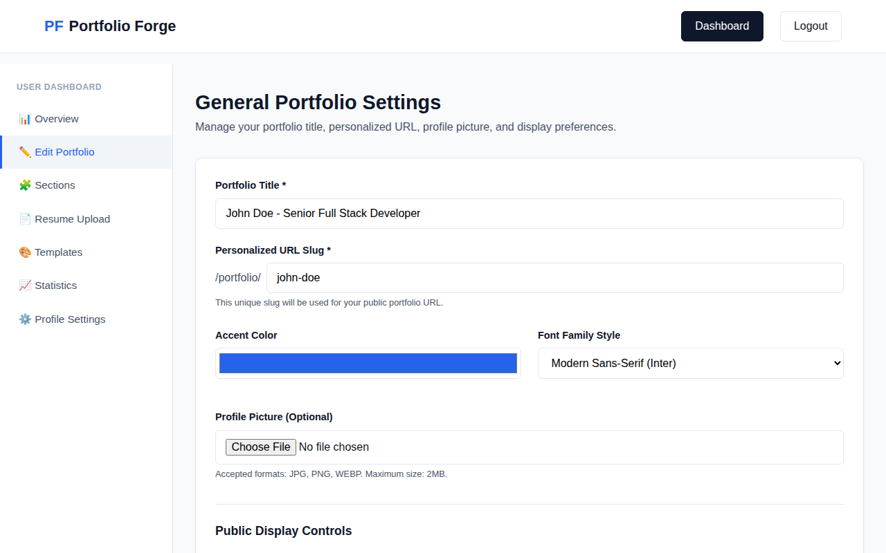

*Figure 8.5 Portfolio Information Module: Portfolio Information Module*

---

## 8.6 Portfolio Sections Module
Portfolio information is organized into modular sections such as About Me, Education, Skills, Projects, Experience, Certifications, Languages, Activities, and Interests. Users can edit content, remove entries, reorder display hierarchy, and control section visibility on the published portfolio.

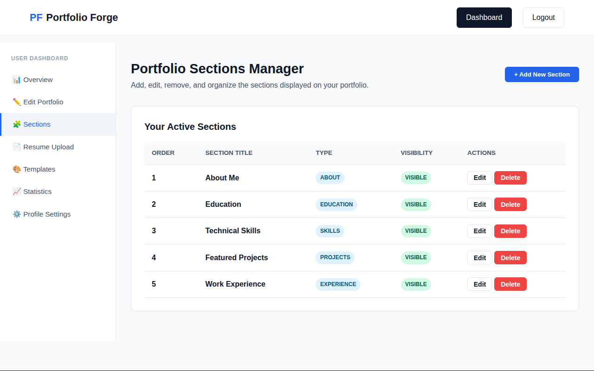

*Figure 8.6 Portfolio Sections Module: Portfolio Sections Module*

---

## 8.7 Resume Upload Module
The resume module enables users to upload supported resume documents (PDF / DOCX). Uploaded files undergo MIME type validation, extension verification, size limit enforcement (2MB max), and automated association with the user's portfolio.

*Figure 8.7 Resume Upload Module: Resume Upload Module*

---

## 8.8 Resume Text Extraction and Parsing Module
The system processes uploaded resume documents using document parsing and text extraction algorithms. Extracted text is analyzed to identify key sections (email, phone, technical skills, experience) and automatically populates editable portfolio fields.

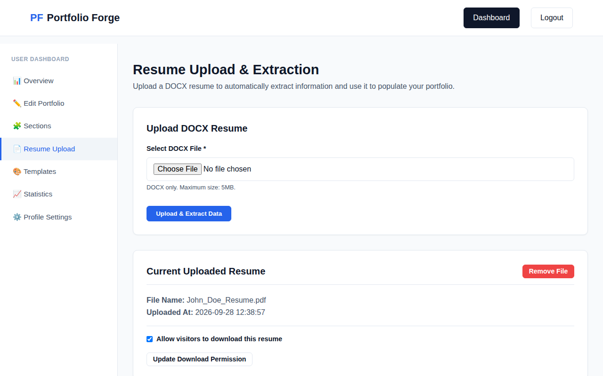

*Figure 8.8 Resume Text Extraction and Parsing Module: Resume Text Extraction and Parsing Module*

---

## 8.9 Template Selection Module
Users can select from available portfolio layout templates (Modern, Minimal, Professional, Creative, Classic). Template selection dynamically changes the presentation layer without altering or losing any stored portfolio information.

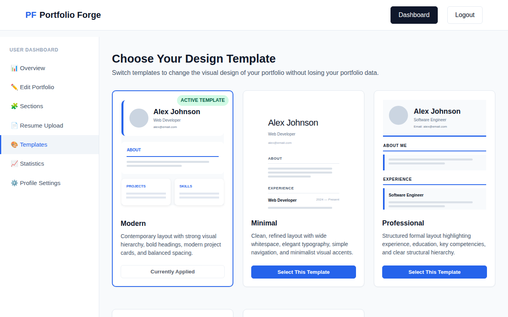

*Figure 8.9 Template Selection Module: Template Selection Module*

---

## 8.10 Portfolio Customization Module
This module provides visual customization controls, including accent color pickers, font family selectors, section display ordering, and granular visibility toggles for profile images, email, phone number, and physical location.

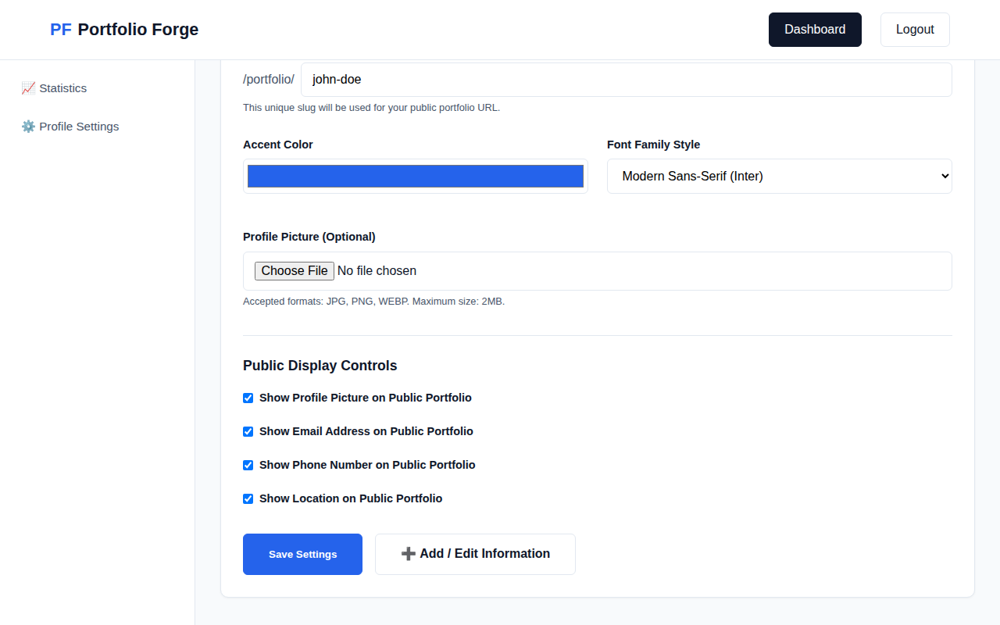

*Figure 8.10 Portfolio Customization Module: Portfolio Customization Module*

---

## 8.11 Portfolio Preview Module
The preview module allows portfolio owners to inspect the rendered layout and formatting of their portfolio in real-time before or after publishing. Owner preview views are strictly separated from public visit analytics tracking.

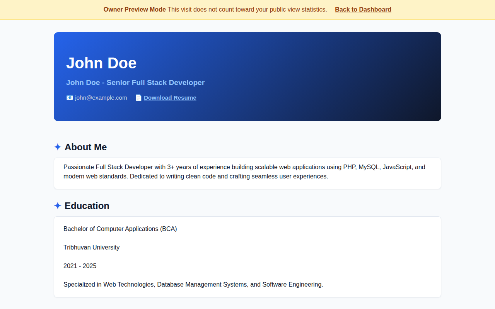

*Figure 8.11 Portfolio Preview Module: Portfolio Preview Module*

---

## 8.12 Public Portfolio Module
A published portfolio is publicly accessible via its unique personalized URL route (e.g., `/portfolio/john-doe`). The system validates publication status, retrieves visible portfolio sections, applies the selected template layout and accent styling, and renders the public web page.

*Figure 8.12 Public Portfolio Module: Public Portfolio Module*

---

## 8.13 Portfolio Analytics Module
The analytics module tracks public visitor traffic, records timestamped visit entries in the database, and provides analytical view metrics to the portfolio owner. Preview activity by the portfolio owner is filtered out from visitor statistics.

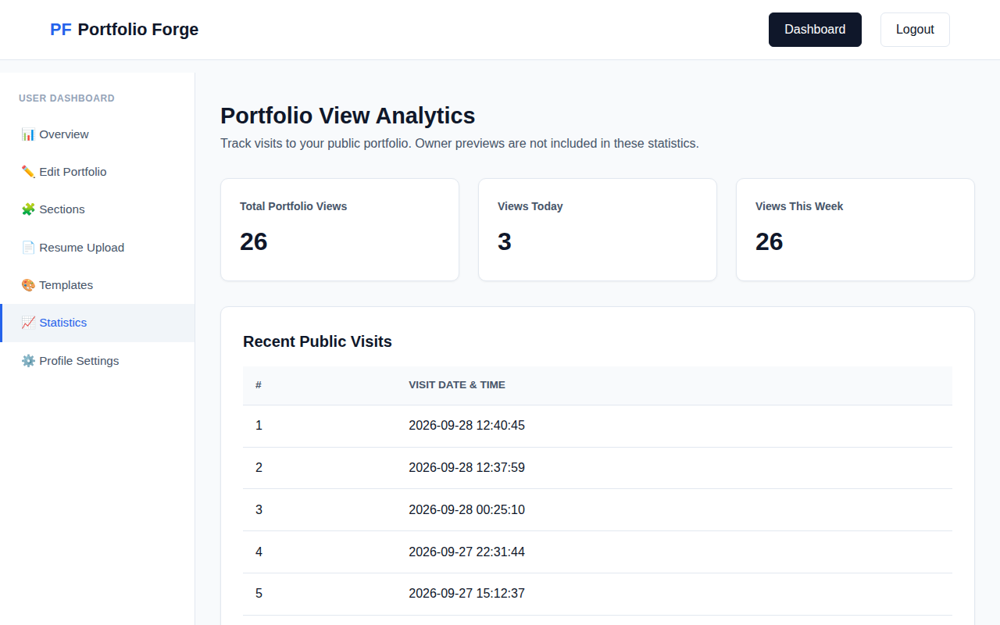

*Figure 8.13 Portfolio Analytics Module: Portfolio Analytics Module*

---

## 8.14 Resume Download Module
When public resume download is enabled by the portfolio owner, public visitors can view and download the uploaded PDF/DOCX resume file directly from the published portfolio header or action toolbar.

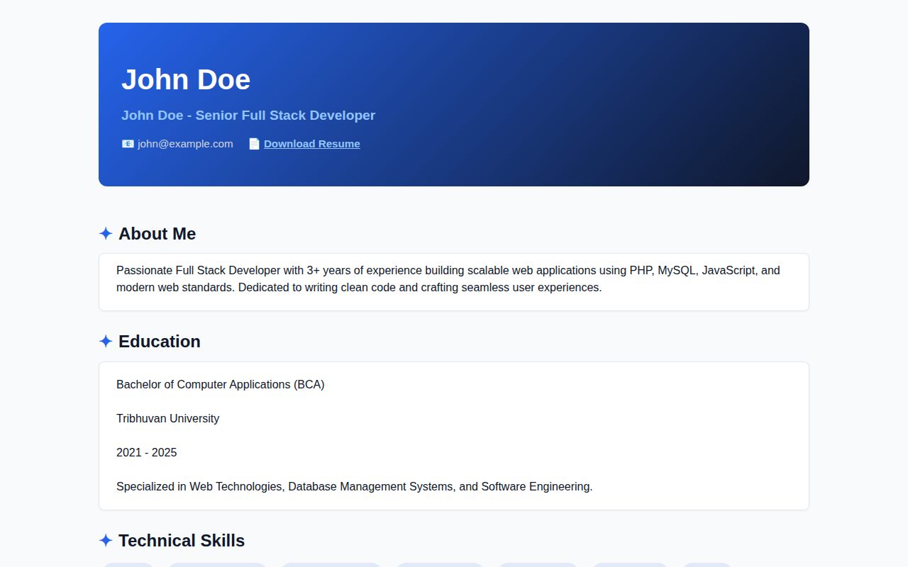

*Figure 8.14 Resume Download Module: Resume Download Module*

---

## 8.15 Administrator Login Module
The administrator authentication module utilizes a dedicated authentication routine to verify administrator credentials (`admins` table) and grant access to privileged platform management functionality.

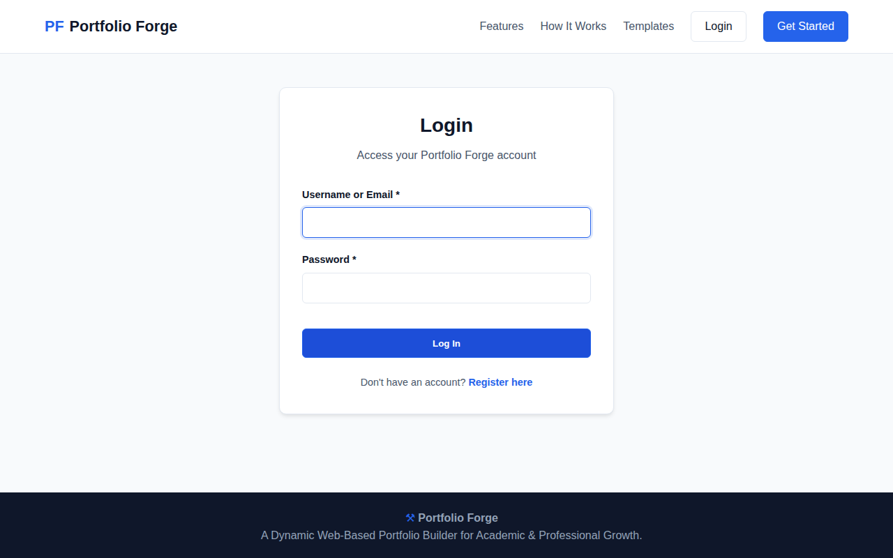

*Figure 8.15 Administrator Login Module: Administrator Login Module*

---

## 8.16 Administrator Dashboard Module
The administrator dashboard provides platform-level operational visibility, displaying aggregate metrics such as total registered users, active portfolios, available templates, and cumulative public visit statistics across the platform.

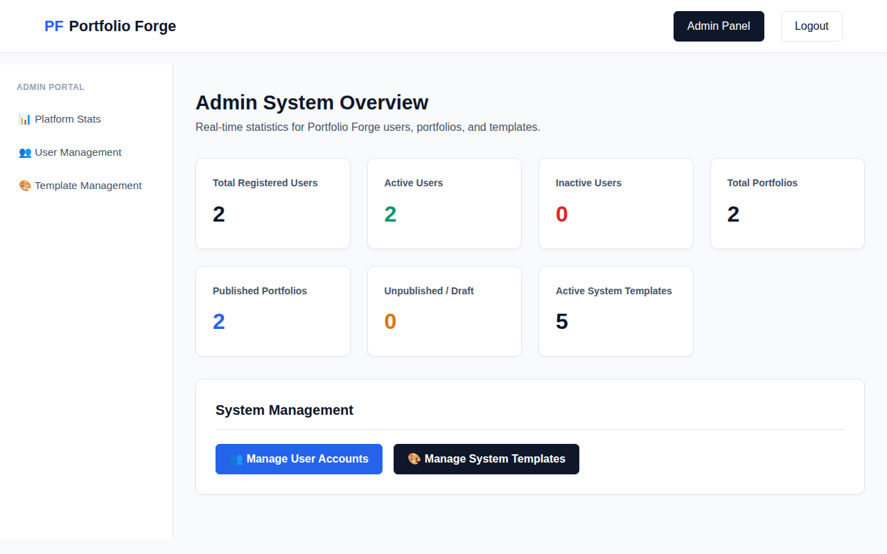

*Figure 8.16 Administrator Dashboard Module: Administrator Dashboard Module*

---

## 8.17 User Account Management Module
Administrators can inspect all registered user accounts, view account creation dates and portfolio publication status, and toggle account activation status (Active/Inactive) while preserving underlying user data.

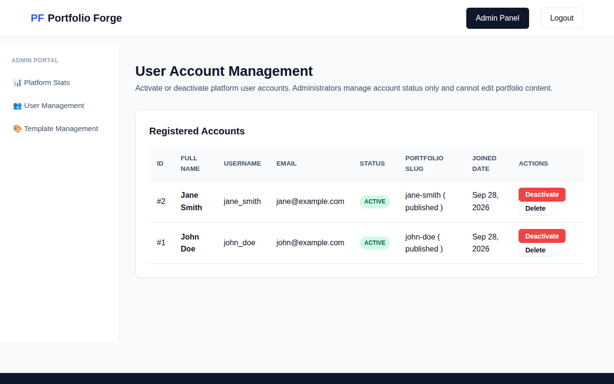

*Figure 8.17 User Account Management Module: User Account Management Module*

---

## 8.18 Template Administration Module
Administrators can manage system template availability by viewing template usage metrics and toggling active status (Active/Disabled) to control template choices for end users.

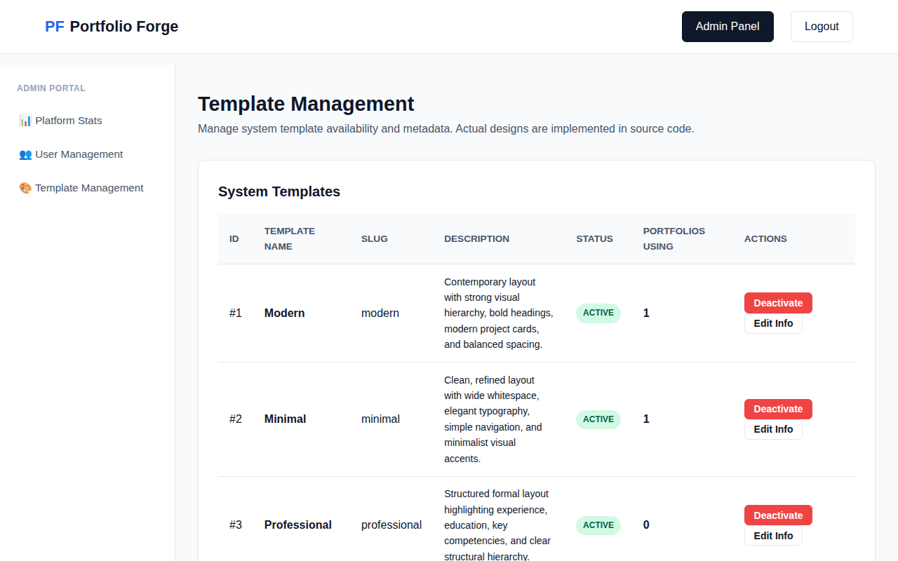

*Figure 8.18 Template Administration Module: Template Administration Module*

---

## 8.19 Database Module
The relational database layer (`portfolio_forge`) manages relational storage for users, administrators, templates, portfolios, portfolio sections, uploaded resumes, and public visit logs. Entity relationships and foreign key constraints ensure database consistency and referential integrity.

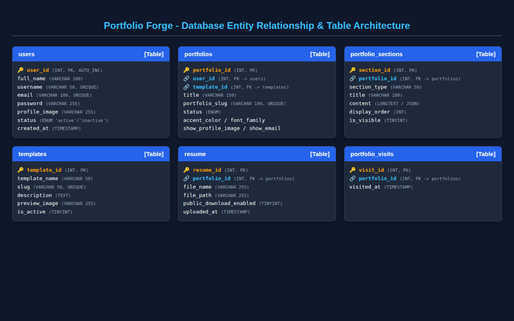

*Figure 8.19 Database Module: Database Module*

---

## 8.20 Security and Validation Module
The security architecture implements robust application-level protections, including standard password hashing (`password_hash()`), PDO prepared statements to eliminate SQL injection, session-bound CSRF token verification, MIME-type file upload validation, and active account session guards.

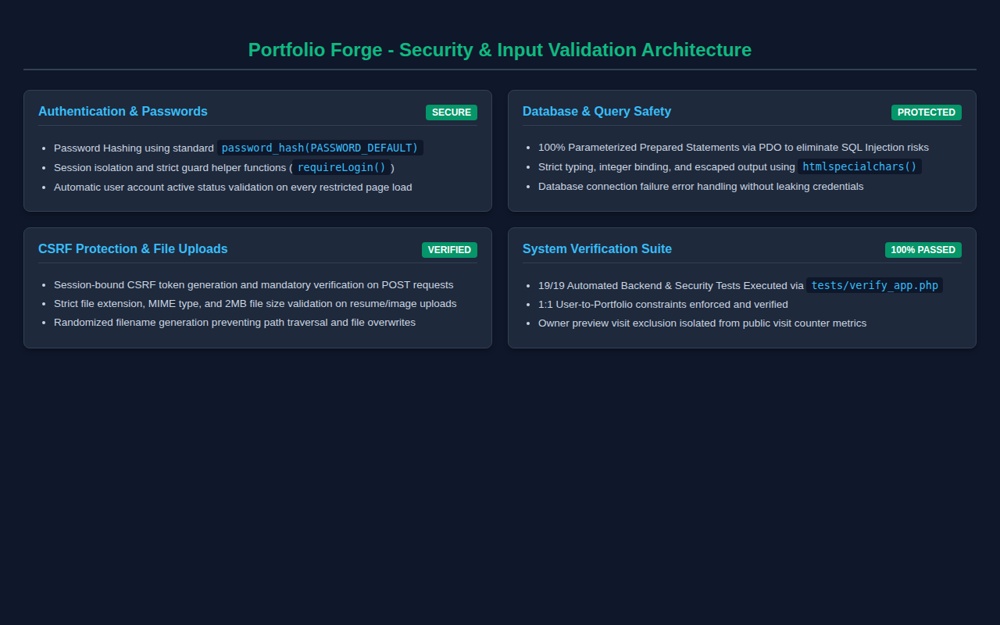

*Figure 8.20 Security and Validation Module: Security and Validation Module*
